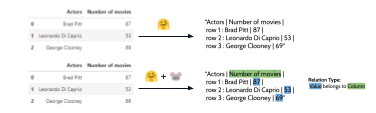

# RATransformers 🐭

 

**RATransformers**, short for Relation-Aware Transformers, is a package built on top of [transformers 🤗](https://github.com/huggingface/transformers)
that enables the training/fine-tuning of models with extra relation-aware input features.

### Example - Encoding a table in TableQA (Question Answering on Tabular Data)

[[Notebook Link](https://github.com/JoaoLages/RATransformers/blob/main/notebooks/TableQA_tabfact_example.ipynb)]

In this example we can see that passing the table as text with no additional information to the model is a poor representation.

With RATransformers 🐭 you are to able to encode the table in a more structured way by passing specific relations within the input.
RATransformers 🐭 also allows you to pass further features related with each input word/token.

Check more examples in [[here](https://github.com/JoaoLages/RATransformers/blob/main/notebooks/)]

## Installation

Install directly from PyPI:

    pip install ratransformers

## Supported Models
Currently we support a limited number of transformer models:
- [BART](https://huggingface.co/docs/transformers/model_doc/bart)
- [BERT](https://huggingface.co/docs/transformers/model_doc/bert)
- [GPT-2](https://huggingface.co/docs/transformers/model_doc/gpt2)
- [RoBERTa](https://huggingface.co/docs/transformers/model_doc/roberta)
- [T5](https://huggingface.co/docs/transformers/model_doc/t5)

Want another model? Feel free to open an [Issue](https://github.com/JoaoLages/RATransformers/issues) or create a [Pull Request](https://github.com/JoaoLages/RATransformers/pulls) and let's get started 🚀
