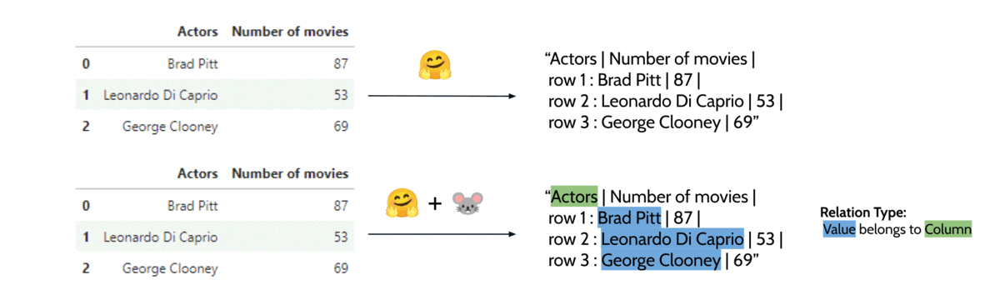

# RATransformers 🐭

 

**RATransformers**, short for Relation-Aware Transformers, is a package built on top of [transformers 🤗](https://github.com/huggingface/transformers)
that enables the training/fine-tuning of models with extra relation-aware input features.

## Installation

Install directly from PyPI:

    pip install ratransformers
    
## Examples

### TableQA: Question Answering on Tabular Data
